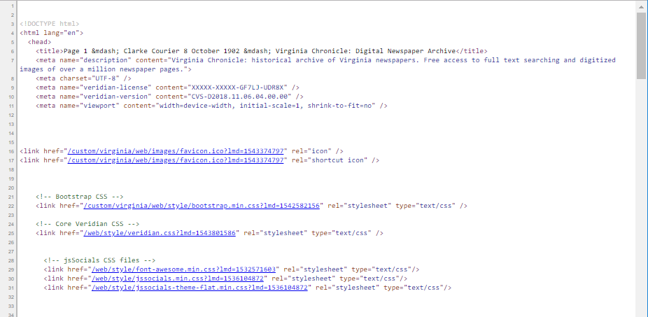
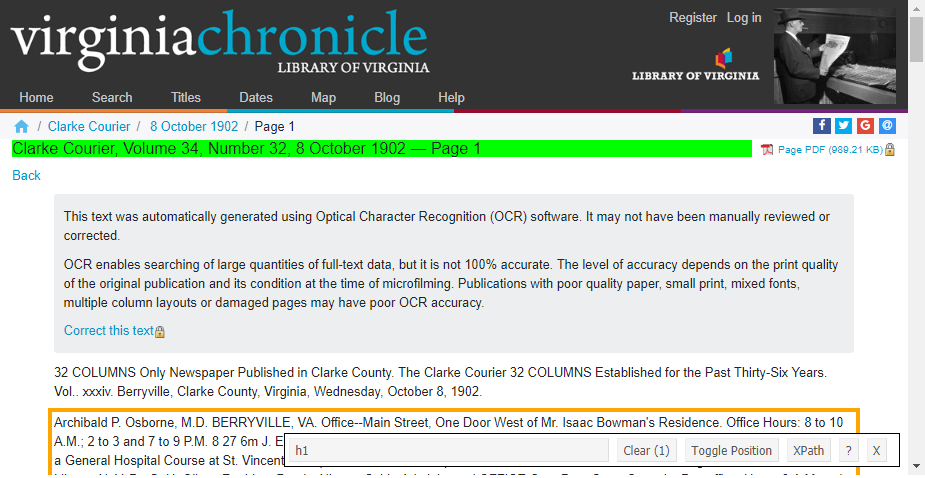
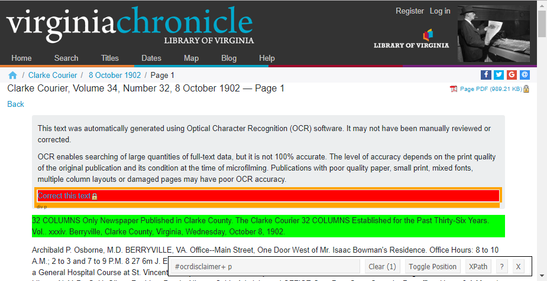
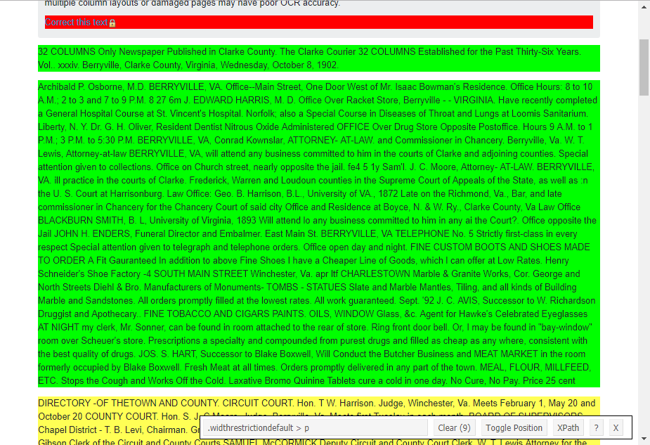

```{r setup, include=FALSE}
knitr::opts_chunk$set(echo = TRUE)
if (!(require(dplyr))) {
  install.packages("dplyr", repos = "http://cran.us.r-project.org")
}
if (!(require(tidyr))) {
  install.packages("tidyr", repos = "http://cran.us.r-project.org")
}
if (!(require(stringr))) {
  install.packages("stringr", repos = "http://cran.us.r-project.org")
}
if (!(require(rvest))) {
  install.packages("rvest", repos = "http://cran.us.r-project.org")
}
if (!(require(knitr))) {
  install.packages("knitr", repos = "http://cran.us.r-project.org")
}
library("dplyr")
library("tidyr")
library("stringr")
library("rvest")
library("knitr")
```

Welcome to this introductory workshop on techniques for web scraping! 

Obtaining and wrangling data is often one of the most difficult parts of a digital humanities project. Even though there is an ever-growing wealth of data online, much of it isn't in tidy, single-file downloads. Instead, most is strewn across multiple webpages and structured in ways that, while visually intuitive, aren't amenable to our (or our computer's) formatting needs. This is where web scraping comes in.

## Getting Started and RStudio

Take a look around: you're in RStudio, an environment that makes coding in R more transparent. Let's take a brief tour. Your window is divided into four segments. In the upper right, you'll see the environment: this displays all the objects you currently have loaded into memory. In the upper left, you'll see the script editor: this is the place to work on code that you're currently writing (or borrowing from elsewhere!). To run code in code chunks (the grey chunks), you can either press Ctrl+Enter to run single lines or click the green arrow to run the entire chunk (Ctrl+Shift+Enter will do the same). In the lower left, you'll see the console: this is where code actually executes and where the output prints. In the lower right, you'll see a few different things. The "Files" tab shows whatever files live in the directory (or folder) that R is currently working in; if you run any plots, they'll show up in the "Plots" tab; you can also get help in the "Help" tab.

If you're using your own computer, run the section of setup code above by clicking the green arrow in the upper right of the grey box. We'll mainly rely on the [`rvest` package](https://cran.r-project.org/web/packages/rvest/rvest.pdf) for scraping content from the web and the popular [`dplyr` package](https://cran.r-project.org/web/packages/dplyr/dplyr.pdf) for working with that content. Packages are a common aspect of coding in R: they contain user-written functions designed to make analysis faster and easier.

We'll also be using a web browser extension, [SelectorGadget](https://selectorgadget.com/), to help us understand the webpages we're scraping. Since this tool is built for the Google Chrome web browser, [you'll need to download that](https://www.google.com/chrome/) if you don't already have it.

But in order to scrape webpages, it's necessary first  to understand some of the basics of how webpages work.

## HTML and CSS

HTML (Hypertext Markup Language) is the foundational language behind everything you see online: it tells your browser how to structure a webpage. HTML is a markup language, which means it uses tags to designate how or where something should appear - this "something" is often plain text but it can also images or effects generated by more complicated bits of code. For example, here's what a very simple HTML document might look like.
```
<html>
  <body>
    <h1>This is a header</h1>
    <p>This is a paragraph.</p>
    <p>Note how each tag is enclosed by greater-than and less-than signs.</p>
    <p>Note that the end of a tag includes a slash as well.</p>
    <p>Tags are often nested, as for <i>italics</i> or <b>boldface</b></p>
  </body>
</html>
```
Though more complex HTML will contain much more nesting, it will always follow this basic grammar.

Here are a few other very common HTML tags we'll encounter today:

Tag       | Description
----------|--------------------------------------------
`<div>`   | a section of a page, set off by line breaks
`<span>`  | a section of a page, within a line
``   | an image
`<a>`     | a link
`<ul>`    | defines an unordered list
`<li>`    | designates each list item
`<table>` | defines a table
`<tr>`    | designates each table row
`<td>`    | a single cell in a table

Nicely-documented HTML code will also include some class or id labels, which are especially convenient to make use of when webscraping. These labels both look the same syntactically: they occur within the initial tag after the name of the tag itself with an `=` sign and a name for the label, as such:
```
<span id=titleYear>1976</span>
<span class=genre>comedy</span>
```
The brief HTML example above would make a totally functional webpage, but it would decidedly bland. So developers also use CSS (Cascading Style Sheets) in tandem with HTML in order to further design webpage aesthetics. For example, if we wanted to make the text color red and the font size smaller just in the body paragraphs, we would add this bit of code right before the `<body>` tag in our example above:
```
<style>
  p {color:red; font-size:14px;}
</style>
```
This code would only change text inside `<p>` HTML tags - not all text - because we've qualified our CSS with a selector, the single letter `p` that comes before the curled brackets. CSS selectors are used to identify which parts of HTML code a particular stylization should be applied to. This example is quite basic, but there is an entire system of CSS selectors capable of making even the most idiosyncratic HTML identifications.

For a slightly more complex example, let's say we wanted to change change the font color only for italicized or bolded text within a paragraph (and not, ex., in a header). Listing one HTML tag before another selects all instances of the second that occur inside the first: in this case, all text in an italics tag that is also inside a paragraph tag. By using a comma, we can make multiple selections. So our new CSS code would look like this:
```
<style>
  p i, p b {color:red; font-size:14px;}
</style>
```
We won't go into the details of CSS stylization. It's useful to familiarize ourselves with the system of selection, however, because it is not only how webpages are built: it's also how we'll identify what HTML content we want to scrape.

Here are a few other very common CSS selectors that we'll encounter today:

Selector           | Description 
-------------------|-------------------------------------------------------------------------------
`div`              | selects all `<div>` elements
`li, td`           | selects all `<li>` elements and all `<td>` elements
`div td`           | selects all `<td>` elements within `<div>` elements
`body > span`      | selects all `<span>` elements that are direct children of the `<body>` element
`table + div`      | selects all `<div>` elements that directly follow a `<table>`
`table ~ div`      | selects all `<div>` elements that come anywhere after a `<table>`
`:not(div)`        | selects everything but `<div>` elements
`div:nth-child(2)` | selects all `<div>` elements that are the second child of their parents
`.author`          | selects all elements with the class "author"
`#year`            | selects all elements with the id "year"

With this brief overview under our belts, we'll be able to make sense of some actual webpages.

## Using CSS Selectors

Let's open a relatively basic sample webpage for starters: [a single digitized newspaper page](https://virginiachronicle.com/?a=d&d=CC19021008.1.1&dliv=none&st=1) from the Virginia Chronicle database.

Even though you could get pretty good at guessing some of the tags that went into generating a webpage, we wouldn't be able to infer its exact structure simply by looking at it; as the saying goes, there's more than one way to skin a cat, especially when our cat is a complex webpage. 

Conveniently, several browsers allow us to see behind the curtain. To do this in the Google Chrome browser, right-click anywhere on the webpage (or, on a Mac, control+click) and select "View Page Source." This opens a new tab in which you'll be able to see the HTML document that generates the webpage.

```{r, echo=FALSE, out.width="70%"}

```

There's a fair bit going on here, but scrolling through you'll be able to make out the text of the webpage and even recognize several of the tags. But it would take some time to get familiar enough with this webpage to come up with the specific CSS selector for identifying a particular element and nothing else: after all, you'll notice that most HTML tags are used many times for many different parts of a webpage.

Luckily, because HTML and CSS code is so regular and hierarchically structured, there are tools to help with this. We'll use a tool called [SelectorGadget](https://selectorgadget.com/), a Chrome browser extension that helps identify HTML elements simply by clicking on them on the webpage itself. Follow this link and click "Just install the Chrome extension"; it'll only take a second.

Go back to our sample page and hit refresh. In the upper-right portion of the browser window you should now notice an icon of a magnifying glass. Click this, and now move your mouse over the page; you'll notice various highlighted borders now show up.

Try selecting just the line that reads "Clarke Courier, Volume 34, Number 32, 8 October 1902 — Page 1." This highlights the selection green, and the SelectorGadget window at the bottom of the screen will now list "h1": the highlighted selection is enclosed in an `<h1>` HTML tag and thus the CSS selector necessary to refer to it is simply `h1`. But are there any other `<h1>` tags that would get pulled in with this one? To double-check simply scroll the page looking for any other highlighted section; nothing this time, so we're safe.

```{r, echo=FALSE, out.width="70%"}

```

Now select the first paragraph outside the grey notice box. The SelectorGadget window at the bottom of the screen tells us that the appropriate CSS selector for this content is `p`. But there is a lot of other content highlighted yellow: this text is all contained within `<p>` HTML tags as well, which means using the `p` selector would scrape all of it.

Clicking a yellow-highlighted section will exclude it, turning its highlighted color to red and un-highlighting all similar content. Do this for any one of the paragraphs in the grey notice box. SelectorGadget will then try to guess what you want based on the initial pick of what to include and this subsequent pick of what to exclude: `#ocrdisclaimer+ p`, or the content within the first `<p>` tag after the content tagged with `id=ocrdisclaimer`.

```{r, echo=FALSE, out.width="70%"}

```

But we want all of the newsprint text, not just the first paragraph. So maneuver the cursor over the second newsprint paragraph and select it. Selecting additional un-highlighted content will highlight it green, including it in the selection too. There should now be: one red selection, two green selections, and a number of yellow selections. The SelectorGadget's suggestion, `.widthrestrictiondefault > p`, will include, as always, everything in green or yellow.[^1] 

```{r, echo=FALSE, out.width="70%"}

```

## Scraping

To actually execute a scrape requires a bit of coding; this is where R comes in.

Let's open a different sample webpage for more practice: a nicely-structured, [standard IMDB page](https://www.imdb.com/title/tt0104940/).

Click the SelectorGadget icon in the upper right corner of the browser. Moving your cursor across the screen, you'll notice this is a more complex webpage. Let's start with something basic: select just the film's title. It looks like a simple `<h1>` tag.

First we need to read our webpage into our environment in R. We'll do that by using a function, `read_html`, to scrape the HTML document; the parameters of a function always go inside parentheses, with quotation marks whenever using characters to designate something that isn't an object in our environment. Then we'll *assign* that scraped HTML document, using `<-`, to an object in our environment with whatever name we'd like: in this case, "page". This is the most basic grammar of R.
```{r}
page <- read_html("https://www.imdb.com/title/tt0104940/")
```

Now to extract just the bit that we want, `h1`. We'll need one function to identify the content we want with a CSS selector, `html_nodes`, and a second function to tell R what to do with the stuff we've selected. In this case we simply want the text, so we'll use `html_text`.

Since we want to use these functions in conjunction - the first wouldn't do us any good without the second and vice versa - we'll use a coding technique called piping. This simply means that we pipe the output of one function directly into the next one, without pausing between each line of code to print or save. This makes our code clearer and more concise. In R, the operator for piping is `%>%`.
```{r}
page %>%
  html_nodes("h1") %>%
  html_text()
```

Since we didn't use a `<-` to assign the result to an object in our environment, R just printed the result in the console. That's fine for now. Notice, though, the gap between the end of the title and the concluding quotation mark. Blank spaces like this are common when scraping HTML; fortunately, simply adding the `trim=TRUE` parameter to `html_text` will trim them.[^2]
```{r}
page %>%
  html_nodes("h1") %>%
  html_text(trim=TRUE)
```

It would be nice to scrape the IMDB rating as well. Hovering over it on the webpage, however, leaves us with several options. Let's try the most capacious one first, `.ImdbRating`.
```{r}
page %>%
  html_nodes(".ImdbRating") %>%
  html_text(trim=TRUE)
```

What went wrong? The result in the console is R's way of indicating that there is no text to return. Let's check the page source in our browser; run a `ctrl+f` search (or `command+f` on Macs) for "ImdbRating". It looks like this class actually embeds an item generated elsewhere. How else could we scrape this rating? Try searching the source code in your browser for "7.7," the unjustly-low score given to this masterpiece of a film. Looks like there are a couple options; see if you can find one and add it to the code below.
```{r, eval=FALSE}
page %>%
  html_nodes("") %>%
  html_text(trim=TRUE)
```

Next, let's try to scrape the entire line of metadata right under the title (since some of it can be scraped separately but other bits can't).
```{r}
meta <- page %>%
  html_nodes(".subtext") %>%
  html_text(trim=TRUE)
```

Type "meta" into the console and hit return to see what this actually looks like. 
```{r}
meta
```

There's some junk in here that wants tidying. For one, all `\n` - which designate a kind of hard-break - should go. For this we'll use the `gsub` function, which substitutes one character pattern with another. `gsub` takes three inputs: the character(s) to be replaced, the character(s) to replace them (in this case the null-character ""), and the object in our environment on which the operation should be carried out.
```{r}
meta <- gsub("\n", "", meta)
meta
```

Right now, `meta` is one single long *character string*, that is, a string of individual characters. But since it actually contains several distinct pieces of information, it would be preferable to split it up into separate strings - indeed, this is what the vertical lines ("|") try to achieve visually. To do this, we'll use the `str_split` function, telling it to split our string every time it hits a vertical line. Since "|" is a special character, we have to include two backslashes to indicate that we merely mean literal vertical lines.
```{r}
meta <- unlist(str_split(meta, "\\|"))
meta
```

The result is a *vector*, a series of individual elements (in this case, of character strings) that we can refer to either as a group or discretely. In order to see the second element, for example, we need only *index* that position of the vector by using square brackets and the number 2:
```{r}
meta[2]
```

Simple though it may seem, the ability to index discrete bits of information is extremely convenient when working with large amounts of data, and it's the bread and butter of more complex computational operations.

Some annoying spaces remain, however. These can be removed with `gsub`, but there's a hitch. Unlike before, we don't know the exact character pattern to replace each time: only that 1) it consists of spaces and 2) those spaces come before and after the group of letters and/or numbers that we actually want. That is, regular but not exact. So we need to use what is called a *regular expression*: an expression that represents a textual pattern rather than a specific string of text. 

Within a regular expression, certain character symbols act as metacharacters, carrying special meaning. For example, `\\d` designates any digit whereas `\\w` designates any letter and `\\s` designates a space. If any of these designations are immediately followed by curled brackets and a number, such as `{4}`, this tells the function to locate four digits, characters, or spaces, respectively; since we don't know the exact number of spaces, we'll instead use `+`, which tells the function to find one or more of whichever kind of character designated immediately before it. Finally, using `(\\1)` in a regular expression in `gsub` indicates that whatever falls in this position should be kept for substitution, which we refer to in `gsub`'s second input field with `\\1`.
```{r}
meta <- gsub("\\s+(\\1)\\s+", "\\1", meta)
meta
```

The results are now sufficiently cleaned and well organized. If we wished, we could also separate out the country of release into a new, 5th element of the vector and remove it from the 4th element of the vector. Since this is intended to serve merely as an introduction to regular expressions, though, we won't go into explanation.[^3]
```{r}
meta[5] <- gsub("^.*\\((\\w+)\\)$", "\\1", meta[4])
meta[4] <- gsub("(^.*)\\s\\(.*$", "\\1", meta[4])
```

You might be thinking: this is taking more time than simply copying and pasting! That may be true of certain elements on some webpages, but not all. Sometimes webpages already have already organized their data with HTML, and simply copying and pasting would require us to re-do all that formatting work. Tables are the most common example of this scenario.

IMDB pages always include a table for the cast list. Return to the web browser and try to determine the best CSS selector for scraping just this table but nothing else. Once you think you've done so, fill in the code below.
```{r eval=FALSE}
cast <- page %>%
  html_nodes("") %>%
  html_text
```

Alas, I've set up another trick question. SelectorGadget's suggestions are all suboptimal in this case. But we know that all HTML tables need a `<table>` tag somewhere. Confirm by searching in the source code.

In order to scrape a table most appropriately, the `html_table` function should replace the `html_text` function. Rather than turning a well-structured HTML table into a messy character string, much as a copy-paste would, `html_table` translates that structure into the R equivalent, a *data frame*.
```{r}
cast <- page %>%
  html_node(".cast_list") %>%
  html_table
```

The object `cast` should now appear in the environment. Click on it, and a data viewer will pop up in the script editor window. As you can see, a data frame is essentially a spreadsheet, like what you might encounter in Microsoft Excel or Google Sheets.

This data isn't quite tidy yet. IMDB squeezes all the roles played by the same actor into a single cell. This kind of shorthand is common in HTML tables: it's easy for humans to read, but it's tougher to work with computationally. Ideally, tidy data will have only a single value in each cell. The `separate_rows` function will fix this, separating out rows with multiple characters into multiple rows, each with the same values for all other columns.
```{r}
cast <- separate_rows(cast, X4, sep="/")
```

Click on `cast` again in the environment; much better. We'd still want to clear out those extra spaces, but we already know how to do that.

There's a lot more we could do to prepare this data frame for future analysis: rename the blank columns, change the column names, etc. This, however, goes into another topic; if you're interested in learning more, check out my [Data 101 workshop](https://github.com/azleslie/Data101).

## Preparing to Scrape Multiple Pages

The real power of web scraping lies in its capacity for regularization. Websites often use individual webpages as part of a broader organizational strucutre: one (newsprint) page per (web) page in the Virginia Chronicle database or one movie per page in IMDB. Knowing that the HTML generating each of these pages is consistent means that the same scraping code can be reused. It might not be very time efficient to write all this code just for a single webpage, but imagine that you wanted to scrape information from one hundred pages. Ultimately, the scraping process should be automated across a series of webpages.

But it gets better. Individual webpages are not only structurally consistent: their addresses are often regularized as well. For example, the first Virginia Chronicle address we looked at contains a lot of valuable information.

https://virginiachronicle.com/?a=d&d=CC19021008.1.1&dliv=none&st=1

The "CC" here is an identifier for the newspaper, the *Clarke Courier*; the long number that follows is actually a date, 08 October 1902. The number after the second period is the page number in the issue for that date. 

If we could add one to the page number up to four (the total issue length for the *Clarke Courier*) and generate a new address each time, we could have the four addresses for the four pages in that issue. If we could do that for every Wednesday of the year, the day on which the newspaper was published, we would have a couple hundred links for every page printed that year; if we could do that for each year that the paper published...

How, then, to generate one address for each page for each date? With a `for` *loop*. A `for` loop executes the same bit of code multiple times, once for each element of an input vector. We'll need two loops here, one for the date and one for the page, the second nested inside the first.

The first step when working with a loop is to initialize empty vectors to store the results in. The `c` function concatenates whatever objects are listed inside it; leaving `c` empty simply defines an empty vector.
```{r}
issue_urls <- c()
all_urls <- c()
```

Now for the loop itself. Since we know that there are 52 weeks in a year and 4 pages in each issue, we know how many times our loops need to run. These will be used to initialize *loop control variables*, which I've simply named `j` and `k`; each time their respective loop completes, these variables will increase by 1. We also know the date of the first weekly issue, January 1, 1902. We'll also make use of R's handy date format, which allows us to add or subtract days according to the calendar automatically.

I've added lines of running commentary here, using pound signs (`#`) to designate that they aren't code, to help explain what's happening as it happens.
```{r}
for (j in 1:52) {
# for each week of the year, 52 times, we're going to...
  
  date <- (as.Date("1902-01-01") + (j-1)*7)
# take our start date, format it as a date, and add 7 days for each week after the first..
  
  date <- gsub("-", "", date)
# remove the dash mark, since we're done with date calculation and the urls lack dashes...
  
  for (k in 1:4) {
# for each page of an issue, 4 times, we're going to...
    
    url <- paste("https://virginiachronicle.com/?a=d&d=CC", date, ".1.", k, 
                 "&dliv=none&st=1", sep="")
# paste together the date, page number, and static bits that form a standard address...
    
    issue_urls[k] <- url
# and save it in its own slot, corresponding to page number, in a vector of issue urls...
    
  }
# close the nested loop...
  
  all_urls <- c(all_urls, issue_urls)
# and add the urls for each page in the issue into a vector containing all the urls so far
}
```

Type `all_urls` into the console and check it out: in just a second, fewer than ten lines of code gave us a vector of all 208 web addresses we want to scrape. In order to scrape content from each of these addresses, from here we would create another `for` loop containing our scraping code.

But addresses are often not so mathematically convenient. So before executing a scrape on a vector of addresses, let's turn to our second example. The IMDB address we've looked at is delightfully simple, but not as rich in literal information:

https://www.imdb.com/title/tt0104940/

How can we get a list of all the addresses we want without already knowing all the information needed to generate them, as we did in the previous example?

If you were to play around with this number a few times, you'd notice that the number used in this address is a unique identifier for each movie and that the movies are generally arranged alphabetically by year of release. Like before, we could try to take advantage of what information is still included in the addresses. If you wanted to scrape all the webpages for movies released within 1990 and 1993, for example, you would simply need to find the first ID number for 1990 and the last ID for 1993; then write a simple `for` loop to `paste` together each address where the ID number is the initial ID number + the loop control variable.

What if you weren't interested in the default, in this case chronological, organizational principle? Websites are meant to be easily traversible: this is the premise of linked data. As such, websites often contain directory pages that put the links to many other pages in one convient place.

IMDB has a number of pages where they list movies according to pre-determined categories, such as [top-rated movies](https://www.imdb.com/chart/top), [Oscar winners](https://www.imdb.com/search/title?count=100&groups=oscar_best_picture_winners), and [the current top box office](https://www.imdb.com/chart/boxoffice). These pages can all be scraped - for their links.

There's just one thing we'll have to change from our usual scraping code in order to scrape links, or `<a>` HTML tags. The content enclosed in an `<a>` tag is actually the text of the link that users see rather than the actual web address, which is technically an attribute defined within the `<a>` tag: the `href` ("hypertext reference") attribute. For example:
```
<a href="https://google.com">Google</a>
```
This also means that `html_text` would return only the text of the link as it appears to us (e.g., the name of each movie); `html_attr` will give us the attribute, the address itself. Along with `html_table`, which we've already used, these constitute the three main functions for converting HTML in the `rvest` package. Aside from these two changes, it's business as usual.
```{r}
directory <- read_html("https://www.imdb.com/chart/top")

pages <- directory %>%
  html_nodes(".titleColumn a") %>%
  html_attr("href")
```

Great; just like that, we now have a vector of links that we can scrape.

## Automating a Scrape

But wait: one more contingency! What if the directory is spread out over multiple pages? This is very common. IMDB, for example, can generate lists of all the movies tagged with a particular genre or combination of genres, which greatly exceeds what can be managed on a single page:

https://www.imdb.com/search/title?genres=comedy&explore=title_type,genres&title_type=movie&ref_=adv_explore_rhs

If we want information about all the movies in this list, we're going to have to scrape the links off of multiple webpages. That means we're going to have to run a preliminary automated scrape in order to get the information we need for our actual automated scrape!

As with before, let's see if we can identify regular patterns in the addresses. Clicking the "next" button on this page generates the next 50 results, #51-100. The address looks like this:

https://www.imdb.com/search/title?title_type=movie&genres=comedy&start=51&explore=title_type,genres&ref_=adv_nxt

The differences between these two addresses are mostly just shuffling around component parts (`genres=comedy` shows up second in the second address rather than first, as in the first address). The major difference is that the second address includes `&start=51`. It stands to reason that we could also generate the first webpage by simply editing the second address so that `&start=1` instead, and indeed we can.

https://www.imdb.com/search/title?title_type=movie&genres=comedy&start=1&explore=title_type,genres&ref_=adv_nxt

This will allow us to regularize all the addresses, changing only that one number each time. 

So we just need a `for` loop that changes one number in the web address each time, scrapes the webpage listing 50 movies tagged as comedy, and keeps only the links to those movies' webpages. 

Since the number must be the next multiple of 50 plus 1 (51, 101, etc.), we'll want to multiply the loop control variable by 50 and add 1: `j*50+1`. But in fact this would cause us to skip over the first page of the list, which of course begins with #1 and not #51. So we'll want to subtract 1 before anything else; this will make the result of multiplication 0 when j=1, which leaves us with 1 after the final addition of 1. This yields the formula `((j-1)*50)+1`.

With this formula in a `paste` function and the scraping code we just used, we're ready to go with our first basic automated scrape.
```{r}
all_urls <- c()

for (j in 1:50) {
  url <- paste("https://www.imdb.com/search/title?title_type=movie&genres=comedy&start=", 
               ((j-1)*50)+1, "&explore=title_type,genres&ref_=adv_nxt", sep="")
  directory <- read_html(url)
  pages <- directory %>%
    html_nodes(".lister-item-header a") %>%
    html_attr("href")
  all_urls <- c(all_urls, pages)
}
```

This should only take a few seconds to run. (Now, these pages are quite information-rich: they contain names, ratings, major actors, duration, additional genres, and more for each movie - by clicking "US Box Office" we can even add that information too. But for the purposes of illustration, we'll pretend otherwise.)

Once the loop completes, check what the results look like by indexing just the first ten elements of `all_urls` in the console. In total, the vector contains 2500 elements: the 50 addresses scraped from each of the 50 pages we've scraped.

Well, not quite. These aren't complete addresses yet: IMDB has left off the "imdb.com" at the beginning of each because it knows they're in the same part of the same larger website. This too is common. So we'll need to `paste` that extra information on to the front of each element in `all_urls` before we scrape. Each of these addresses is the webpage for a single movie. We've already spent some time looking at one of these movie pages, so let's scrape something we're already familiar with: the single line of metadata found underneath each title at the top of the page.
```{r}
all_meta <- c()

for (j in 1:10) {
  url <- paste("https://imdb.com", all_urls[j], sep="")
  page <- read_html(url) 
  all_meta[j] <- page %>%
    html_nodes(".subtext") %>%
    html_text(trim=TRUE)
}
```

This `for` loop does its job well, and look how succinct it is! But we already know from earlier that the results will be a bit messy. Why not tidy them up inside the loop each time? Recall that when we tidied `meta` for a single movie earlier we ended up with a vector of 5 elements. Since this time there are ten movies, we want our results to look like a data frame, or spreadsheet: each movie vector should be transformed into a row and each element a column. So this time we'll initialize a results data frame instead of a results vector.

I've simply copied and pasted into our loop the same lines of code we used to tidy up `meta` before. The last couple lines simply build the data frame: first naming each column of the data frame and specifying which element of the vector belongs to each and then combining the data frame `meta_frame` containing the results of a single pass through the loop with all of the `results` from all passes through the loop thus far.
```{r}
results <- data.frame()

for (j in 1:10) {
  url <- paste("https://imdb.com", all_urls[j], sep="")
  page <- read_html(url) 
  meta <- page %>%
    html_nodes(".subtext") %>%
    html_text(trim=TRUE)

  meta <- gsub("\n", "", meta)
  meta <- unlist(str_split(meta, "\\|"))
  meta <- gsub("\\s+(\\1)\\s+", "\\1", meta)
  meta[5] <- gsub("^.*\\((\\w+)\\)$", "\\1", meta[4])
  meta[4] <- gsub("(^.*)\\s\\(.*$", "\\1", meta[4])

  meta_frame <- data.frame(Certification=meta[1], Runtime=meta[2], Genres=meta[3], 
                         Release_Date=meta[4], Release_Country=meta[5])
  results <- rbind(results, meta_frame)
}
```

Click `results` in the environment and check it out; there are some idiosyncracies we'd want to follow up on, but this data is already quite tidy.[^4]

What if we wanted to scrape content from multiple HTML tags? Since we've already reformated our results as a data frame, this is a simple matter of running another scrape within the same loop and saving it as an additional column. Since movies that aren't released yet don't have ratings, I've added this column with an `if else` statement. `if` the object `rating` contains more than nothing (a `length` greater than 0), then we put it in the Rating column; if not (`else`), we just print "NA" there instead.[^5]
```{r}
results <- data.frame()

for (j in 1:30) {
  url <- paste("https://imdb.com", all_urls[j], sep="")
  page <- read_html(url) 
  meta <- page %>%
    html_nodes(".subtext") %>%
    html_text(trim=TRUE)

  meta <- gsub("\n", "", meta)
  meta <- unlist(str_split(meta, "\\|"))
  meta <- gsub("\\s+(\\1)\\s+", "\\1", meta)
  meta[5] <- gsub("^.*\\((\\w+)\\)$", "\\1", meta[4])
  meta[4] <- gsub("(^.*)\\s\\(.*$", "\\1", meta[4])

  rating <- page %>%
    html_nodes(".ratingValue") %>%
    html_text(trim=TRUE)
  
  new_frame <- data.frame(Certification=meta[1], Runtime=meta[2], Genres=meta[3], 
                         Release_Date=meta[4], Release_Country=meta[5], 
                         Rating=(if (length(rating)>0) {rating} else {"NA"}))
  results <- rbind(results, new_frame)
}
```

Additional scrapes could be added in the same manner.[^6] And with that, we've gone from little to no knowledge about HTML to a fairly robust web scrape!

## Tips for Scraping

To conclude, let's review and distill some of strategies that we've deployed over the course of the workshop.

- Check for redundancy on the webpage.
  The same information may appear a couple times on the same page: some instances might be easier to scrape than others, and some instances might be included with additional information you also want to scrape.
- Make sure the scrape isn't too capacious.
  HTML tags can be used in a number of different ways for different kinds of information on the same webpage. With SelectorGadget, make sure to scroll the entire page to check that nothing is highlighted that you don't want.
- Consult the source code.
  SelectorGadget (and similar tools) doesn't always reveal the most amenable CSS selector. If it seems like there ought to be an easier way, inspect the source: usually there is. 
- Use web addresses to your advantage.
  Edit urls to test out what different components do when trying to regularize them. Use the internal logic of the urls when possible. Additionally, sometimes it is easier to get information from the url than from scraping it off the webpage itself.
- Find the most information-rich kind of webpage on the website for your needs.
  The same information may appear on multiple different kinds of pages across a site: some pages might be easier to scrape than others, and some might contain more of the information you're looking for in a single place. Get to know the website before you scrape.


Finally, we would really appreciate it if you took a minute to [fill out our brief feedback survey](https://rutgers.ca1.qualtrics.com/jfe/form/SV_38eKD4KcjGnGR5r).

If you'd like to look at this workshop in more detail or run the code yourself, visit https://github.com/azleslie/WebscrapeTechniques.

Thanks for participating!


[^1]:There is always more than one way to skin a cat: if the second newsprint paragraph is selected before excluding the grey notice box and the first newsprint paragraph, SelectorGadget will suggest this equally-functional CSS selector instead: `#ocrdisclaimer~ p+ p`.

[^2]:How would you know such a parameter is even available for a function? You could read the documentation for the package it's included in, or even more simply you could use the `help` function, typing `help(html_text)` into the console.

[^3]:There are tons of handy guides to using regular expressions available online; it's much easier to pick up than what it seems. You might check out [the RStudio Regex Cheat Sheet](https://www.rstudio.com/wp-content/uploads/2016/09/RegExCheatsheet.pdf) or [Andrew Goldstone's lesson on the same](https://content.sakai.rutgers.edu/access/content/group/71a813d6-2322-4e4a-94b2-47ab9c063e15/0219-slides.pdf).

[^4]:A quick review of the results data frame illuminates why it's missing some values: movies with release dates that haven't yet happened tend to lack certifications and runtimes.

[^5]:This is necessary because loops often break when they can't execute every step they've been told to. If a programmer is uncertain whether all iterations of a loop will find what it expects, they'll include an `if` statement.

[^6]:Scraping HTML tables as part of an automated scrape involves an extra step. In this particular case, I would probably create a second data frame just for the cast data from all the movies. Before using `rbind` within each iteration of the loop, however, it would be necessary to add a new column to the cast data frame that simply contains the name of the movie. This way, in the resulting data frame including all the casts from all the movies, we would still know which rows belonged to which movies. It would also allow us to merge the cast data frame with the metadata data frame with the `inner_join` function.